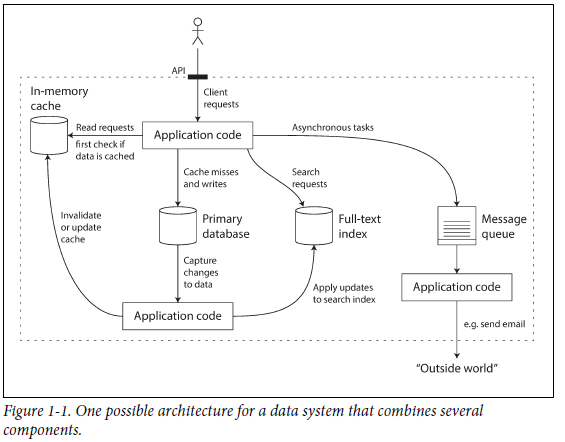

# Reliable, Scalable and Maintainable Applications

Many applications today are *data-intensive*, as opposed to *compute-intensive*. CPU power is rarely limiting factor.

A data-intensive application is typically built from standard building blocks that provide commonly needed functionality. 

For example, many applications need to:
* Store data so that they, or another application, can find it again later (*databases*)
* Remember the result of an expensive operation, to speed up reads (*caches*)
* Allow users to search data by keyword or filter it in various ways (*search indexes*)
* Send a message to another process, to be handled asynchronously (*stream processing*)
* Periodically crunch a large amount of accumulated data (*batch processing*)

Three important factors in data-intensive applications:

**Reliability**

The system should continue to work correctly (performing the correct function at
the desired level of performance) even in the face of adversity (hardware or software
faults, and even human error). 

**Scalability**

As the system grows (in data volume, traffic volume, or complexity), there should
be reasonable ways of dealing with that growth. 

**Maintainability** 

Over time, many different people will work on the system (engineering and operations,
both maintaining current behavior and adapting the system to new use
cases), and they should all be able to work on it productively. 

### Latency vs Response time

*Latency* and *response time* are often used synonymously, but they are not the same. 

The *response time* is what the client sees: besides the actual time to process the request (the *service time*), it includes
network delays and queueing delays. 

*Latency* is the duration that a request is waiting to be handled—during which it is *latent*, awaiting service

#### Measuring performance

It is better to use percentiles to measure performance, than avergae response times i.e. the 95th, 99th, and 99.9th percentiles are common (abbreviated p95, p99, and p999).

They are the response time thresholds at which 95%, 99%, or 99.9% of requests are faster than that particular threshold. 

For example, if the 95th percentile response time is 1.5 seconds, that means 95 out of 100 requests take less than 1.5 seconds, and 5 out of 100 requests take 1.5 seconds or more.
