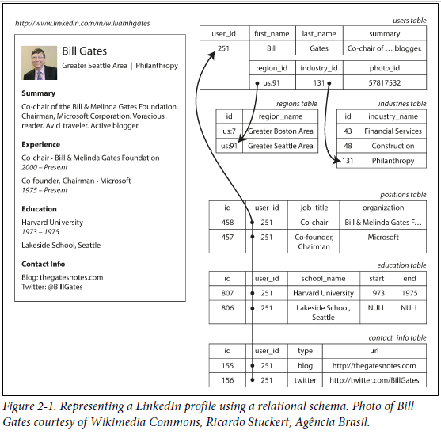
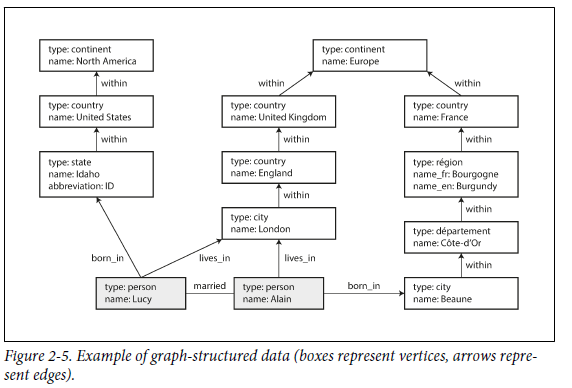

# Data Models

### Introduction

Data Models are most important part of software development, as they have effect not only on how s/w is being written, but also on *how we thing about the problem* we are solving. 

Data Models help layered visuation of the problem. For example, 

* application developers think real world problem in terms of objects, or data structures.
* objects or data structures in turn can be expressed in terms of general purpose data model i.e. JSON/XML documents, tables in relational DB, or a graph model.
* engineers who build databases software decide a way of representing these JSON/XML/relational/graph models in terms of bytes in memory, or disk or in network.
* on yet lower level, h/w engineers figured out to represent bytes in terms of electrical currents, or magentic fields or pules of light.

### Relational vs Document model

Example of Bill Gates resume using relational schema.



Example 2-1. Representing a LinkedIn profile as a JSON document

```
{
"user_id": 251,
"first_name": "Bill",
"last_name": "Gates",
"summary": "Co-chair of the Bill & Melinda Gates... Active blogger.",
"region_id": "us:91",
"industry_id": 131,
"photo_url": "/p/7/000/253/05b/308dd6e.jpg",
"positions": [
    {"job_title": "Co-chair", "organization": "Bill & Melinda Gates Foundation"},
    {"job_title": "Co-founder, Chairman", "organization": "Microsoft"}
  ],
"education": [
    {"school_name": "Harvard University", "start": 1973, "end": 1975},
    {"school_name": "Lakeside School, Seattle", "start": null, "end": null}
  ],
"contact_info": {
  "blog": "http://thegatesnotes.com",
  "twitter": "http://twitter.com/BillGates"
  }
}
```

It can be observed that document model is more appropriate if you have more one-to-many relationships or no relations exists at all. 

### Graph based models

Relational model can handle simple cases of many-to-many relationships. if connections become more complex, then it's good to model the data as graph based.

A graph consists of two kinds of objects: 
* *vertices* (also known as nodes or entities) and
* edges (also known as relationships or arcs). 

Many kinds of data can be modeled as a graph. Typical examples include:

#### Social graphs
Vertices are people, and edges indicate which people know each other.

#### The web graph
Vertices are web pages, and edges indicate HTML links to other pages.

#### Road or rail networks
Vertices are junctions, and edges represent the roads or railway lines between
them.

Well-known algorithms can operate on these graphs: for example, 
* car navigation systems search for the shortest path between two points in a road network, and
* PageRank can be used on the web graph to determine the popularity of a web page and thus its ranking in search results.


